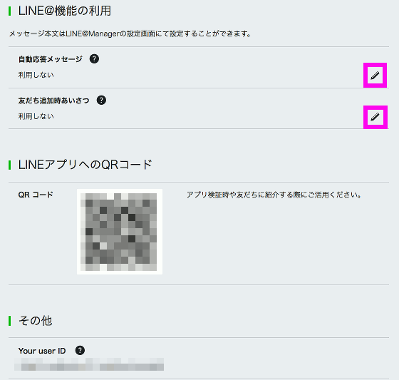

# Channelの作成

## LINE Developers設定

### プロバイダーとChannelの作成

LINE@のアカウントを作成するためには、基本的にはLINE@のページから作成するのですが、  
今回はプッシュメッセージを使用するためDeveloper TrialのLINE@アカウント(Channel)を作成する必要があります。  

Channelを作成するためには、LINE Developersのページから作成する必要があります。
  
LINE Developersのページにアクセスして、「Messaging API（ボット）を始める」をクリックします。  
https://developers.line.me/

初回は開発者登録が必要です。  
必要事項を入力後、正式登録用のメールが届くのでリンクをクリックし、正式登録を済ませます。  

正式登録を済ませた後、「Messaging API（ボット）を始める」をクリックすると、  
以下のような新規Channel作成画面が表示されます。  
「新規プロバイダー作成」をクリックします。  

プロバイダー名の入力画面になります。  
任意のプロバイダー名を入力します。  
「確認」「作成」をクリックします。  

プロバイダーにChannelを作成していきます。  
「Messaging API」をクリックします。  

Messaging APIの情報を入力します。  
アプリアイコン画像、アプリ名、アプリ説明、プラン(Developer Trialになっていることを確認)、  
大業種、小業種、メールアドレスを入力し「確認」をクリックします。

利用規約の同意にチェックを入れて、「作成」をクリックします。  

Channelが作成されました。  
引き続きChannelの設定を行います。 
作成したChannelをクリックします。   

---

### Channelの基本設定

作成したChannelの設定を確認、変更していきます。 

確認すること 
* プラン
  * 「For Developer」になっている
* 利用可能な機能
  * 「REPLY_MESSAGE、PUSH_MESSAGE」

変更すること  
* アクセストークン
  * 「再発行」をクリックする  
* Webhook送信
  * 「利用する」に変更
* Botのグループトーク参加
  * 「利用する」に変更
* 自動応答メッセージ
  * 「利用しない」に変更
* 友達追加時あいさつ
  * 「利用しない」に変更

以上でChannelの設定はいったん終了です。  
このページは後ほど使うので、開いたままにしておきましょう。

---

## LINE@アカウント確認

作成したChannelが、LINE@アカウントとして登録されているかを確認します。

LINE@MANAGERのページにアクセスします。  
https://admin-official.line.me/

作成したChannelがアカウント一覧にあればOKです。

---

## Channel(LINE Bot)を友達に追加

Channel基本設定のページにあるQRコードをスマートフォンのLINEアプリで読み込んで、  
作成したChannelと友達になっておきましょう。  
この時点ではまだWebhook URLが設定されていないので、メッセージを送っても何も返ってこないはずです。  

  

以上の設定ができましたら、[LINE Botの作成](linebot.md) の作成に進みましょう。