# LINE Botの作成

Raspberry PiでLINE Simple Beaconを動作させるためには、LINE Botを作成する必要があります。  
先ほど作成したChannelにWebhook URLを設定して、LINE Botとして使えるようにしましょう。

---

## おうむ返しBotの作成

まずは入力したテキストをそのまま返信する「おうむ返しBot」を作成します。  

Channelに設定するWebhook URLを作成します。  
クラウドサービス上に準備したりHerokuなどのサービスを使うこともできますが、  
今回は手軽かつ無料でできるGoogle Apps Scriptを使います。  

---

### Google Apps Scriptの作成

Googleドライブのマイドライブにアクセスします。  
https://drive.google.com/drive/my-drive

「マイドライブ」 → 「その他」 → 「Google Apps Script」 を選択します。

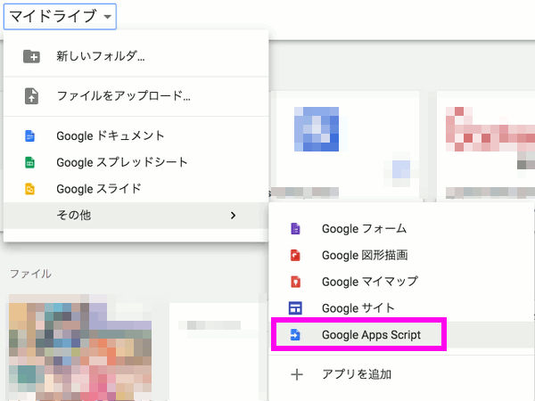

空のプロジェクトが作成されます。

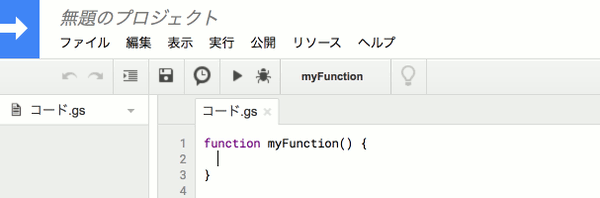

#### ソースコードの編集

コードの部分を以下のように書き換えます。  
CHANNEL_ACCESS_TOKEN には、Channelの設定で発行したアクセストークンを設定してください。

```javascript
var CHANNEL_ACCESS_TOKEN = 'xxxxxxxx';

function doPost(e) {
  var reply_token= JSON.parse(e.postData.contents).events[0].replyToken;
  if (typeof reply_token === 'undefined') {
    return;
  }
  
  // ユーザが入力したメッセージ
  var user_message = JSON.parse(e.postData.contents).events[0].message.text;
  
  // 入力メッセージをreplyTokenに設定して、応答メッセージとする
  var url = 'https://api.line.me/v2/bot/message/reply';
  UrlFetchApp.fetch(url, {
    'headers': {
      'Content-Type': 'application/json; charset=UTF-8',
      'Authorization': 'Bearer ' + CHANNEL_ACCESS_TOKEN,
    },
    'method': 'post',
    'payload': JSON.stringify({
      'replyToken': reply_token,
      'messages': [{
        'type': 'text',
        'text': user_message,
      }],
    }),
  });
  return ContentService.createTextOutput(JSON.stringify({'content': 'post ok'})).setMimeType(ContentService.MimeType.JSON);
}
```

このファイルを [echoback.gs](../src/echoback.gs) として保存します。  

#### Webアプリケーションとして公開する

「公開」メニューから「Webアプリケーションとして導入」を選択します。

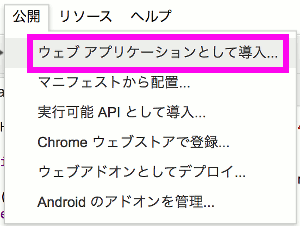

ウィンドウが表示されるので、以下のように入力します。  
* プロジェクトバージョン
  * 新規作成
  * ver.1 を入力
* アプリケーションのアクセスできるユーザー
  * 全員(匿名ユーザーを含む)に変更

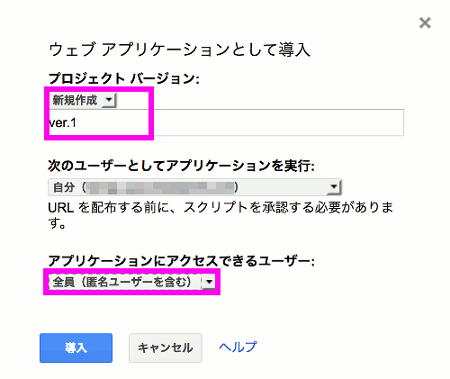

承認が必要です のウィンドウが表示されるので、「許可を確認」をクリックします。

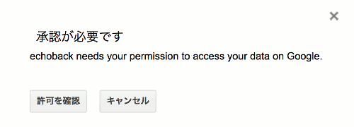

アカウントの選択ウィンドウが表示されるので、選択します。

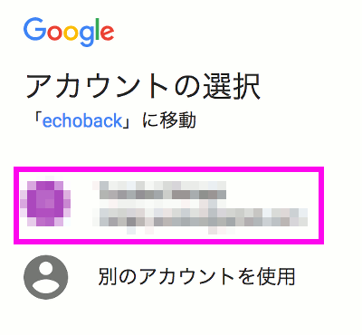

「許可」を選択します。

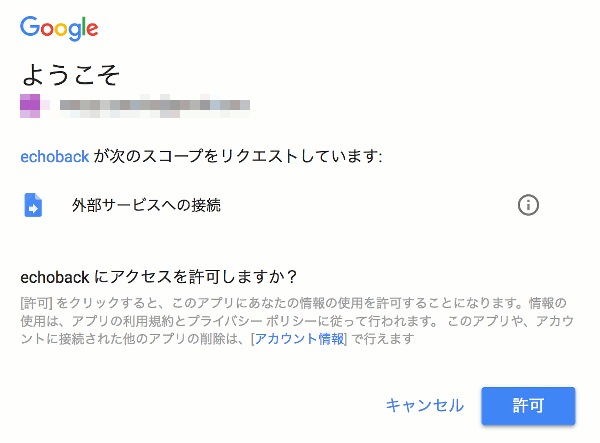

WebアプリケーションのURLが作成されました。  
後ほどWebhook URLとして設定するのでコピーして控えておきましょう。

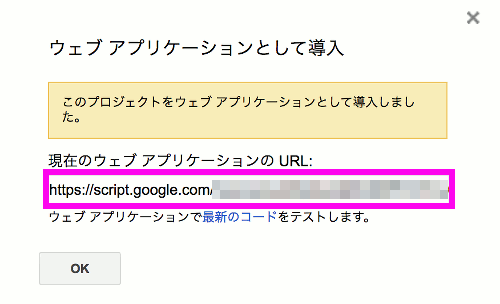

---

### Webhook URLの設定

LINE DevelopersのChannelの基本設定画面に戻り、Webhook URLの設定を行います。  
先ほどコピーしたURLを設定します。先頭の https:// は既に入力されているので必要ありません。  
入力できたら「更新」をクリックします。

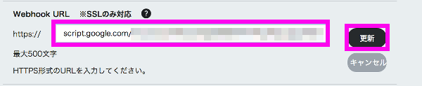

---

### おうむ返しBotを試してみる

ここまでの設定で、おうむ返しのLINE Botができあがりました。  
スマートフォンのLINEアプリから、先ほど友達になったLINE Botアカウント(Channel)にメッセージを送ってみましょう。  
送ったテキストと同じテキストが返ってきたら成功です。  

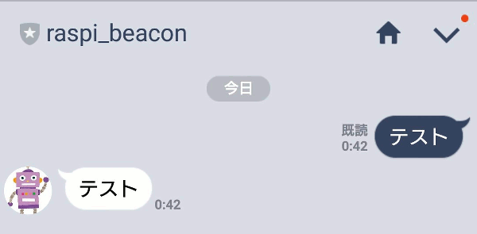


---

## Beacon応答メッセージスクリプトの作成

続いて、ビーコンシステム用のスクリプトを作成していきます。  
同じファイルを編集してもよいのですが、ここでは新しいファイルを作成することにします。

例として、以下のようなスクリプトを書いてみます。
* LINE Simple BeaconのイベントがPostされたら 名前+ID+イベント(到着or退出)を応答する。
* LINE Botにメッセージが送信されたら、名前+ID+入力メッセージ を応答する。

「ファイル」 → 「新規作成」 → 「スクリプト ファイル」 を選択します。

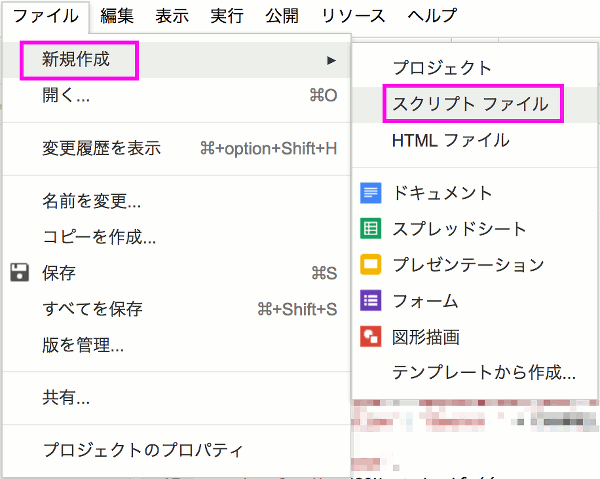

ファイル名を入力します。ここでは [beacon_reply.gs](../src/beacon_reply.gs) としました。

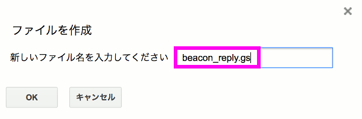

先ほどと同様にコードを以下のように編集します。

```javascript
var CHANNEL_ACCESS_TOKEN = 'xxxxxxxx';

function doPost(e) {
  var reply_token= JSON.parse(e.postData.contents).events[0].replyToken;
  if (typeof reply_token === 'undefined') {
    return;
  }

  var reply_message;
  var event_type, beacon_type, user_id, display_name;
  var url, response;
   
  event_type = JSON.parse(e.postData.contents).events[0].type; 
  user_id = JSON.parse(e.postData.contents).events[0].source.userId;

  // プロフィールの取得
  // userId から displayName を取得
  url = 'https://api.line.me/v2/bot/profile/' + user_id;
  response = UrlFetchApp.fetch(url, {
    'headers': {
      'Content-Type': 'application/json; charset=UTF-8',
      'Authorization': 'Bearer ' + CHANNEL_ACCESS_TOKEN,
    },
  });
  display_name = JSON.parse(response).displayName;

  // ビーコンイベントの場合
  if (event_type === 'beacon') {
    beacon_type = JSON.parse(e.postData.contents).events[0].beacon.type;
    // メッセージを作成
    if (beacon_type === 'enter') {
      reply_message = display_name + '[' + user_id + ']到着しました';
    } else if (beacon_type === 'leave') {
      reply_message = display_name + '[' + user_id + ']退出しました';
    }

  // その他の場合(名前+ID+おうむ返し)
  } else {
    reply_message = display_name + '[' + user_id + ']' + JSON.parse(e.postData.contents).events[0].message.text;
  }

  url = 'https://api.line.me/v2/bot/message/reply';
  UrlFetchApp.fetch(url, {
    'headers': {
      'Content-Type': 'application/json; charset=UTF-8',
      'Authorization': 'Bearer ' + CHANNEL_ACCESS_TOKEN,
    },
    'method': 'post',
    'payload': JSON.stringify({
      'replyToken': reply_token,
      'messages': [{
        'type': 'text',
        'text': reply_message,
      }],
    }),
  });
  return ContentService.createTextOutput(JSON.stringify({'content': 'post ok'})).setMimeType(ContentService.MimeType.JSON);
}
```

同様に「公開」メニューから「Webアプリケーションとして導入」を選択します。  
(スクリプトを更新する場合、プロジェクト バージョンは、必ず「新規作成」にして新しい番号を入力してください。)  

先ほどとは異なるWebアプリケーションのURLが作成されます。  

これをコピーして、LINE DevelopersのChannelの基本設定画面でWebhook URLの設定を更新しましょう。


この状態ではまだビーコンは動作していませんが、おうむ返しBotの部分は動作しますので確認してみましょう。  
おうむ返しのテキスト情報の他に、名前とIDが取得できていればOKです。

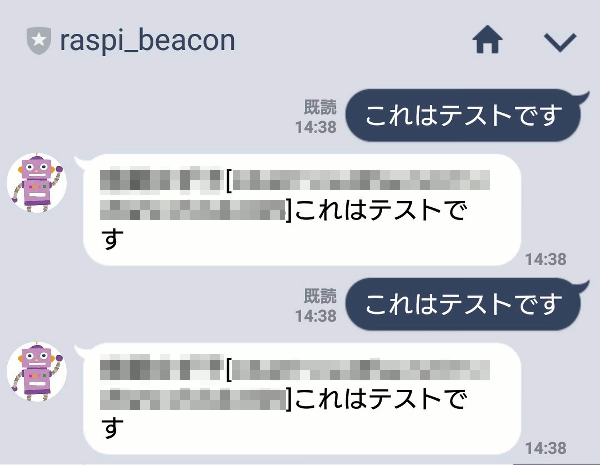

---

LINE Botが作成できましたら、[LINE Simple Beaconの設定](linesimplebeacon.md) に進みましょう。

---

## 参考資料

### Google Apps Script の URL Fetchのリファレンス

"Class UrlFetchApp". Google Apps Script Reference.  
https://developers.google.com/apps-script/reference/url-fetch/url-fetch-app

### LINE Messaging API の ドキュメント

"Messaging API". LINE Developers ドキュメント.  
https://developers.line.me/ja/docs/messaging-api/overview/

"APIリファレンス". LINE Developers ドキュメント Messaging API.  
https://developers.line.me/ja/docs/messaging-api/reference/

* メッセージ 応答メッセージを送る
* Webhookイベントオブジェクト ビーコンイベント
* プロフィール プロフィールを取得する

---