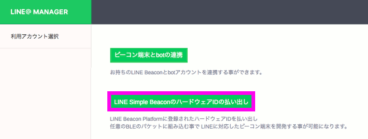
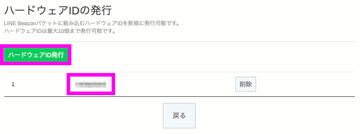

# LINE Simple Beaconの設定

LINE Botで、おうむ返しBotやIDを取得できるBotを作成できました。  
最後に、Raspberry PiにLINE Simple Beacon環境を構築し、LINE Botと連携させましょう。

## LINE Simple BeaconのHWIDの払い出し

LINE Simple Beaconを使用するためにはハードウェアIDを発行してもらう必要があります。  
以下のページから申請します。  
https://admin-official.line.me/beacon/register#/

「LINE Simple BeaconのハードウェアIDの払い出し」を選択します。



アカウント一覧からアカウントを選択します。


ハードウェアIDの発行をクリックし、発行されたID(10桁の16進数の値)を控えておきます。



---
ここから先は Raspberry Pi上の操作になります。  
PCからsshでログインして、コマンド実行ができる状態になっているという前提です。

## Bluetooth関連パッケージのインストール

Raspberry PiにBluetooth関連のパッケージをインストールします。

```bash
$ sudo apt-get install bluetooth bluez libbluetooth-dev libudev-dev
```

## Node.jsのバージョンアップ

Raspberry PiにプリインストールされているNode.jsはバージョンが古いです。  

```bash
$ node -v
v4.8.2
```

[ここ](https://github.com/line/line-simple-beacon/blob/master/tools/line-simplebeacon-nodejs-sample/README.md)をみると Node.js は v6.x.x 以上が必要なようです。  
以下のコマンドを実行して、Node.jsをバージョンアップしましょう。  

```bash
$ sudo apt-get install -y nodejs npm
$ sudo npm cache clean
$ sudo npm install n -g
$ sudo n stable
$ sudo ln -sf /usr/local/bin/node /usr/bin/node
$ sudo apt-get purge -y nodejs npm
```
* [こちら](https://qiita.com/seibe/items/36cef7df85fe2cefa3ea)のページを参考にさせていただきました。  
v6.x.x 以降のNode.jsがインストールされればどのような方法でもよいと思います。

バージョンを確認します。
```bash
$ node -v
v9.2.0
```

## LINE Simple Beaconの実行環境の準備

Raspberry PiにLINE Simple Beaconの実行環境をダウンロードします。  
コンソールから以下のコマンドを実行して、ダウンロードとセットアップを行います。

```bash
$ git clone https://github.com/line/line-simple-beacon.git
$ cd ./line-simple-beacon/tools/line-simplebeacon-nodejs-sample
$ npm install
```

## ビーコンの実行

セットアップが終わったら、LINE Simple Beaconを実行します。  
オプションの --hwid には先ほど取得したハードウェアIDを設定します。

```bash
$ sudo ./simplebeacon.js --hwid=xxxxxxxxxx
stateChange: poweredOn
<Buffer 02 01 06 03 03 6f fe 0b 16 6f fe 02 xx xx xx xx xx 7f 00>
```

このプログラムを実行させたまま、スマートフォンをRaspberry Piに近づけてみましょう。  
以下のようなメッセージが届けば成功です。


スマートフォンを持ったままRaspberry Piから遠ざかると、退出のメッセージが届くはずです。  
(理論的には5m程度までの範囲が検出されるらしい)

LINE Simple Beaconのプログラムを終了させる際は、ctrl+c で終了します。

---

Raspberry Pi(LINE Simple Beacon)とLINE Botの連携ができましたら、[プッシュメッセージの送信](pushmessage.md) に進みましょう。

---
## 参考情報

"ラズベリーパイでLINE Beaconが作成可能に！「LINE Simple Beacon」仕様を公開しました".  
LINE Enginerring Blog.  
https://engineering.linecorp.com/ja/blog/detail/117

"さっそく、LINE Simple BeaconをRaspberryPi3で試してみました #iotlt #botawards". Qiita.  
http://qiita.com/n0bisuke/items/60523ea48109320ad4a5

"line-simple-beacon". GitHub.  
https://github.com/line/line-simple-beacon

"Ubuntuに最新のNode.jsを難なくインストールする". Qiita.  
https://qiita.com/seibe/items/36cef7df85fe2cefa3ea

---