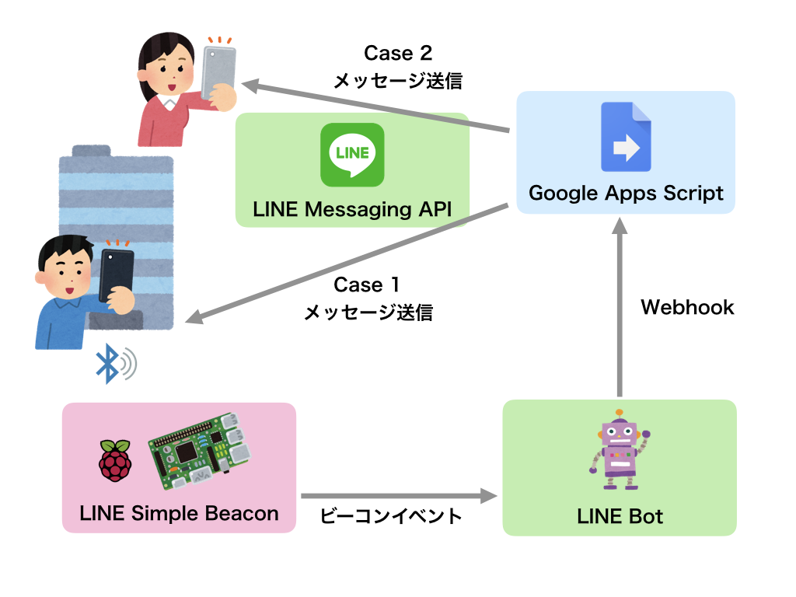

# システム概要

## 作成するシステム

スマートフォンを持ってRaspberry Pi(Beacon)に近づくと、スマートフォンのLINEアプリに  
Raspberry Pi(Beacon)からのメッセージが届くシステムを作成します。

さらに詳細な構成のイメージです。

* Raspberry Pi
  * Raspberry Piに LINE Simple Beaconの環境を構築する
* LINE Bot
  * LINE Bot用のLINE@アカウント(Developer Trial)を作成し、LINE Simple Beaconと連携させる
  * LINE BotにWebhook URLを設定し、LINE Simple Beaconのイベントを受け取った際に  
  Google Apps Scriptを実行するように設定する
* Google Apps Script
  * スクリプトをWebアプリケーションとして公開することで、LINE BotのWebhook URLとして設定する
  * スクリプト内でLINE BotからのPostイベントを検知して、LINE Messaging APIでメッセージ送信を行う
* ユーザ
  * LINE Simple Beaconに紐づけられたLINE Botを友達登録する
  * LINEアプリをインストールしたスマートフォンを持ってRaspberry Piに近づくと
    * (Case 1)ユーザのLINEアプリにメッセージが届く(応答メッセージ)
    * (Case 2)Case 1に追加して、開発者のLINEグループにメッセージが届く(プッシュメッセージ)

では、実際に作成していきます。  
[アカウントの設定](accountsetting.md) に進んでください。