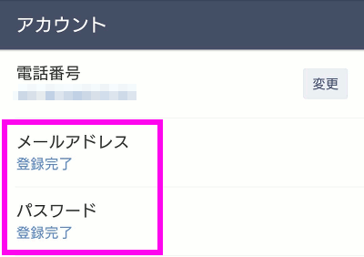

# 事前準備と用語説明

## 事前準備
### LINEのインストール・ユーザ登録

スマートフォンにLINEアプリをインストールし、ユーザ登録を行ってください。  
詳細な方法は割愛します。 

### LINEのメールアドレス登録

LINE@を使用する際にメールアドレス登録が必要となります。  
スマートフォンのLINEアプリでメールアドレス登録を行ってください。  

LINEアプリの その他 → 設定 → アカウント → メールアドレス

 

メールアドレスが登録完了となっていればOKです。

### Googleアカウントの登録

Googleのアカウントを作成してください。  
詳細な方法は割愛します。

## 用語説明

今回作成するシステムを構築する上で知っておく必要がある用語がありますので、簡単に紹介します。

---

### LINE@

LINE@はLINEが提供している事業者向けアカウントです。  
スポーツ選手のアカウントのようにブログ配信情報などを通知してくれる一方通行のものや、  
ヤマト運輸のアカウントのように再配達以来などの双方向のコミュニケーションができるものもあります。  

> LINE@は、ビジネスや情報発信に活用できる会社・事業者向けのLINEアカウントです。  
> 企業、ブランド、商品の魅力をお客様に発信するためのさまざまな機能が備わっています。

"LINE@". http://at.line.me/jp/

個人でも使用することができ、フリープランは無料で使用できます。(2017/11/23現在)  
"LINE@の料金プラン". LINE@ プラン・料金. http://at.line.me/jp/plan  

---

### LINE Bot

LINE@とLINE Messaging APIを使用してチャットボットの仕組みを実現しているものを、一般的にLINE Botと呼んでいるようです。  
LINE Botという名前のサービスが提供されているわけではありません。  

---

### LINE Messaging API

LINE Messaging APIは、LINE@と組み合わせてチャットボットを実現するためのAPIです。  

> Messaging APIを使うと、ボットアプリのサーバーとLINEプラットフォームの間でデータを交換できます。

"Messaging API". LINE developers ドキュメント. https://developers.line.me/ja/docs/messaging-api/overview/

Messaging APIにも料金プランがあり、Developer Trialは無料で使うことができます。(2017/11/23現在)  
"Messaging APIで利用できる料金プラン". LINE@ プラン・料金. 
http://at.line.me/jp/plan  

---

### LINE Beacon

LINE Beaconは、LINEが提供しているBeacon仕様です。  
LINEアプリのインストールされたスマートフォンを持ってLINE Beacon対応のビーコン端末に近づくと、  
LINEアプリにメッセージを通知するというようなことができます。

> LINE Beacon を使用することで、LINE ユーザーがビーコンの範囲に入ったり離れたりした際に ビーコン webhook イベント を受け取ることができます。  
> ビーコンを使用して、特定のコンテキストでボットが対応するようにカスタマイズできます。

"ビーコンを使う". LINE developers ドキュメント. https://developers.line.me/ja/docs/messaging-api/using-beacons/

LINE Beaconには、LINE Beacon対応のビーコン端末、LINE Simple Beacon規格を採用しているBLE端末の2種類があります。

---

### LINE Simple Beacon

> LINE Simple Beaconとは、LINE Bot開発者向けのビーコンデバイス仕様です。  
> LINE Simple BeaconはBluetooth Low Energy (以下、「BLE」という)の仕様にもとづいており、 汎用のデバイスでLINE Beaconのサービスを利用することを可能とします。

"line-simple-beacon". github.
https://github.com/line/line-simple-beacon/blob/master/README.ja.md

LINE Simple Beaconは、Raspberry PiやMacなどのBLE対応デバイス上に構築することができます。
今回はこちらをRaspberry Pi上に構築します。

---

### Google Apps Script

Google Apps Scriptは、Googleが提供するクラウド上のスクリプト環境です。  
スプレッドシート、Gmail、カレンダーなどのGoogleのサービスをクラウド上のJavaScript環境で操作することができます。

"Google Apps Script". https://developers.google.com/apps-script/

今回は、Google Apps ScriptをWebアプリケーションとして公開し、LINE BeaconのWebhook URLとして使用します。

---

次は、[システム概要](overview.md) へ進みます。

