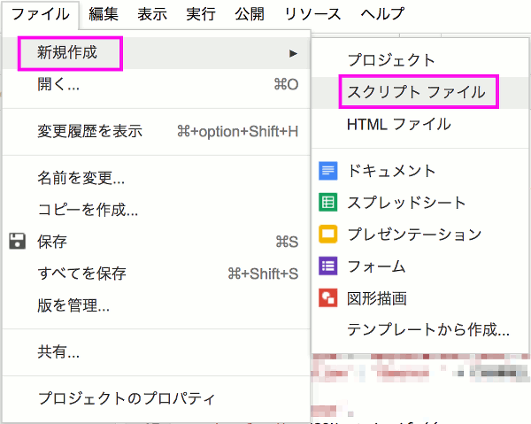

# プッシュメッセージの送信

Raspberry Pi(LINE Simple Beacon)とLINE Botの連携ができるようになりました。  

この状態では、Beaconのエリア内に入ったスマートフォンに応答メッセージを返すことはできますが、  
特定のLINEグループにメッセージが届きません。

最後に、プッシュメッセージのAPIを使って、指定したLINEグループにメッセージが届くようにしてみましょう。

## 開発者のLINEグループの作成

スマートフォンのLINEアプリで、自分とLINE Botの2人だけのグループを作成します。  
LINEアプリの「友だち」メニューの右上にある「友だち追加」のマークをタップします。


「グループ作成」をタップします。


グループ名を入力し、先ほど作成したLINE Botをメンバーに追加します。


LINEグループが作成できました。

## LINEグループID取得スクリプトの作成

特定のグループにプッシュメッセージを送信するためには、LINEグループのグループIDを取得する必要があります。  
おうむ返しBotを応用して、グループIDを取得するスクリプトを作成します。

Google Apps Scriptの新規ファイルを作成します。ファイル名は [getgroupid.gs](../src/getgroupid.gs) とします。



コードを以下のように編集します。  

```javascript
var CHANNEL_ACCESS_TOKEN = 'xxxxxxxx';

function doPost(e) {
  var reply_token= JSON.parse(e.postData.contents).events[0].replyToken;
  if (typeof reply_token === 'undefined') {
    return;
  }

  var reply_message;
  var user_id, display_name, group_id;
  var url, response;
   
  user_id = JSON.parse(e.postData.contents).events[0].source.userId;
  group_id = JSON.parse(e.postData.contents).events[0].source.groupId;

  // プロフィールの取得
  // userId から displayName を取得
  url = 'https://api.line.me/v2/bot/profile/' + user_id;
  response = UrlFetchApp.fetch(url, {
    'headers': {
      'Content-Type': 'application/json; charset=UTF-8',
      'Authorization': 'Bearer ' + CHANNEL_ACCESS_TOKEN,
    },
  });
  display_name = JSON.parse(response).displayName;

  // ユーザー名+UserID+GroupID+おうむ返し
  reply_message = display_name + '[' + user_id + '][' + group_id + ']' + JSON.parse(e.postData.contents).events[0].message.text;

  url = 'https://api.line.me/v2/bot/message/reply';
  UrlFetchApp.fetch(url, {
    'headers': {
      'Content-Type': 'application/json; charset=UTF-8',
      'Authorization': 'Bearer ' + CHANNEL_ACCESS_TOKEN,
    },
    'method': 'post',
    'payload': JSON.stringify({
      'replyToken': reply_token,
      'messages': [{
        'type': 'text',
        'text': reply_message,
      }],
    }),
  });
  return ContentService.createTextOutput(JSON.stringify({'content': 'post ok'})).setMimeType(ContentService.MimeType.JSON);
}
```

「公開」メニューから「Webアプリケーションとして導入」を選択します。  

* プロジェクトバージョン
  * 新規作成
  * ver.3 を入力

## グループIDの確認

スマートフォンのLINEアプリから、Beaconグループにメッセージを送信してみましょう。  
以下のようにグループIDが取得できていればOKです。  
(モザイクでわかりにくいですがピンク色の部分がグループIDになります。)


グループIDは後で使いますので控えておきましょう。

## 応答メッセージとプッシュメッセージを送るスクリプトの作成

最後に、ビーコンイベントの応答メッセージ(ビーコンに近づいたユーザー宛て)と特定のグループへのプッシュメッセージの両方を送るスクリプトを作成します。

Google Apps Scriptの新規ファイルを作成します。  
ファイル名は [beacon_reply_push.gs](../src/beacon_reply_push.gs) とします。

コードを以下のように編集します。  
BEACON_GROUP_ID には、先ほど取得したグループIDを入れてください。

```javascript
var CHANNEL_ACCESS_TOKEN = 'xxxxxxxx';
var BEACON_GROUP_ID = 'xxxxxxxx'

function doPost(e) {
  var reply_token= JSON.parse(e.postData.contents).events[0].replyToken;
  if (typeof reply_token === 'undefined') {
    return;
  }
  var event_type, beacon_type; 
  var push_message, reply_message;
  var user_id, group_id;
  var url;
  
  group_id = BEACON_GROUP_ID;

  event_type = JSON.parse(e.postData.contents).events[0].type; 
  user_id = JSON.parse(e.postData.contents).events[0].source.userId;
  
  // プロフィールの取得
  // userId から displayName を取得
  url = 'https://api.line.me/v2/bot/profile/' + user_id;
  response = UrlFetchApp.fetch(url, {
    'headers': {
      'Content-Type': 'application/json; charset=UTF-8',
      'Authorization': 'Bearer ' + CHANNEL_ACCESS_TOKEN,
    },
  });
  display_name = JSON.parse(response).displayName;
  
  // ビーコンイベントの場合
  if (event_type === 'beacon') {
    beacon_type = JSON.parse(e.postData.contents).events[0].beacon.type;
    if (beacon_type === 'enter') {
      push_message = display_name + 'さんが到着しました';
      reply_message = display_name + 'の到着を通知します';
    } else if (beacon_type === 'leave') {
      push_message = display_name + 'さんが退出しました';
      reply_message = display_name + 'の退出を通知します';      
    }
    
  // その他の場合(名前+ID+おうむ返し)
  } else {
    push_message = '';
    reply_message = display_name + '[' + user_id + ']' + JSON.parse(e.postData.contents).events[0].message.text;
  }

  // 応答メッセージの送信
  url = 'https://api.line.me/v2/bot/message/reply';
  UrlFetchApp.fetch(url, {
    'headers': {
      'Content-Type': 'application/json; charset=UTF-8',
      'Authorization': 'Bearer ' + CHANNEL_ACCESS_TOKEN,
    },
    'method': 'post',
    'payload': JSON.stringify({
      'replyToken': reply_token,
      'messages': [{
        'type': 'text',
        'text': reply_message,
      }],
    }),
  });
  ContentService.createTextOutput(JSON.stringify({'content': 'post ok'})).setMimeType(ContentService.MimeType.JSON);

  // プッシュメッセージの送信(ビーコンイベントの場合のみ)
  if (event_type === 'beacon') {  
    url = 'https://api.line.me/v2/bot/message/push';
    UrlFetchApp.fetch(url, {
      'headers': {
        'Content-Type': 'application/json; charset=UTF-8',
        'Authorization': 'Bearer ' + CHANNEL_ACCESS_TOKEN,
      },
      'method': 'post',
      'payload': JSON.stringify({
        'to' : group_id,
        'messages': [{
          'type': 'text',
          'text': push_message,
        }],
      }),
    });
    ContentService.createTextOutput(JSON.stringify({'content': 'post ok'})).setMimeType(ContentService.MimeType.JSON);
  }
  return;
}
```

「公開」メニューから「Webアプリケーションとして導入」を選択します。  

* プロジェクトバージョン
  * 新規作成
  * ver.4 を入力

## ビーコンシステムの動作確認

ビーコンシステムが完成しました。  
Raspberry PiでLINE Simple Beaconを実行した状態(simplebeacon.jsを実行した状態)で、スマートフォンを持ってRaspberry Piに近づいたり離れたりして、LINEアプリの動作を確認してみましょう。  
以下のようなメッセージが届いたら成功です。  

raspi_beaconとのトーク


Beaconグループ


自分のスマートフォンで動作確認ができたら、周りの人にLINE Botを友だち追加してもらい、LINEアプリにどんなメッセージが送られてくるか確認してみましょう。

